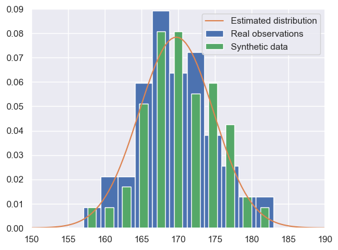

# Datan generointi

Synteettistä dataa voidaan generoida monilla eri tavoin.
Mallit noudattavat kuitenkin aina samaa perusperiaatetta:
Jollain matemaattisella mallilla pyritään estimoimaan opetusdatasta mikä
on koko populaation todellinen jakauma, ja poimimaan tästä
jakaumasta uusia näytteitä.

Tämä on sisimmiltään sama idea kuin sovitattaessa dataan:
Datasta lasketaan keskiarvo $\mu$ ja varianssi $\sigma^2$,
ja näiden määrittämä normaalijakauma on estimaatti populaation
todellisesta jakaumasta.
Nyt voitaisiin poimia lisää arvoja tästä jakaumasta, joiden
jakauma noudattaisi läheisesti laskettua jakaumaa.

Tämä mekanismi on taustalla kaikissa tässä tutoriaalissa
esitellyissä menetelmissä.
Eri menetelmät sisältävät kuitenkin omat vahvuutensa ja
heikkoutensa, ja usein parhaan menetelmän tietää
vasta kokeilemisen jälkeen.

## Käyttöohje
1. Varmista että Python, Jupyter notebook, ja tarvittavat paketit ovat asennettu
2. Aja kenttä kerrallaan jokainen notebookin solu käyttämällä esimerkkidataa tai vaihtamalla halutun datan polku alkuun
3. Tallenna generoitu data
4. Siirry validointiin