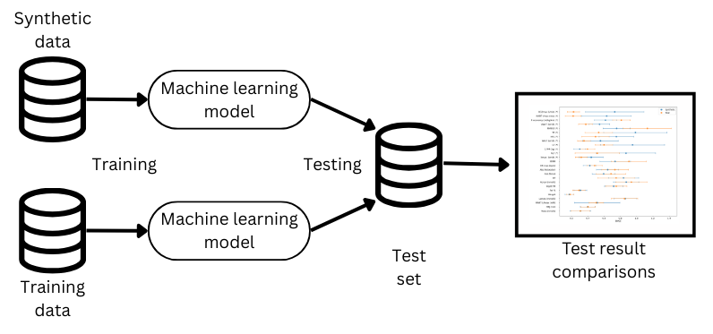

# Synteettisen datan validointi

Jotta generoitua dataa voidaan viedä käytäntöön, täytyy varmistua sen laadusta.
Tämä ei ole kuitenkaan kovin yksinkertainen tehtävä,
vaikka synteettinen data on määritelmältään melko selkeä: keinotekoisesti luotua dataa
joka vastaa jakaumaltaan aitoa dataa. Haluamme kuitenkin että synteettinen data ei olisi
täysin aidon datan kopio yksityisyyden säilyttämiseksi, joka aiheuttaa ristiriidan datan laatuun.
Tavoitteena on siis luoda hyvää, muttei liian hyvää, dataa.

Synteettisen datan laadun tarkastelulle on siksi kehitetty monia viitekehyksiä,
joista selkein lienee kolmijakoinen:
1. Fidelity
2. Utility
3. Privacy

Näistä Fidelity ja Utility mittaavat synteettisen datan "hyvyyttä".
Fidelity käyttää metriikoinan tilastollisia menetelmiä mitaten synteettisen ja aidon datan jakaumien eroavaisuuksia.
Näistä yksinkertasena esimerkkinä voidaan laskea jokaisesta muuttujasta keskiarvot ja vertailemalla keskiarvojen eroja
synteettisen ja aidon välillä.

Utility taas nimensä mukaisesti mittaa käytettävyyttä. Sitä mitataan testaamalla kuinka hyvin synteettinen data
suoriutuu aidossa käyttöympäristössä.
Validointiprosessissa tätä pyritään simuloimaan Train Real - Test Real (TRTR) ja Train Real - Test Real (TRTR)
-kokeilla. Näissä jokin malli luodaan aidon datan perusteella ja testataan riippumattomalla aidolla testidatalla (TRTR) ja 
tämän testituloksia verrataan tuloksiin jotka on saatu samasta mallista mutta synteettisellä datalla opetettuna, testattuna
kuitenkin samalla riippumattomalla testidatalla (TSTR).
Tuloksien tulisi olla mahdollisimman samankaltaisia kaikilla malleilla, riippumatta mallin tarkkuudesta.
Hyvien mallien pitäisi olla yhtä hyviä synteettisellä kuin aidolla datalla, mutta huonojen mallien samalla yhtä huonoja.

Siinä missä Fidelity ja Utility yleensä korreloivat positiivisesti, Privacy on näitä vastaan.
Intuitiivisesti voidaan ajatella että mitä enemmän informaatiota jaetaan, sitä tarkempia ennustuksia voidaan tehdä
ja päinvastoin.
Synteettisen datan tapauksessa sen yksityisyydellä tarkoitetaan kuinka paljon synteettinen data paljastaa 
aidosta datasta.
Esimerkisi jos data olisi syntetisoitu huolimattomasti ja synteettiset datapisteet muistuttaisivat liikaa
aitoja, voitaisiin tehdä hyviä arvauksia aidoista datapisteistä ja pahimmillaan palauttaa aito data.
Tämän korjaaminen lisäämällä kohinaa yksityshenkilöiden häivyttämiseksi luonnollisesti heikentää datan informaatiota ja
potentiaalista ennustusvoimaa.
Yksityisyyttä voidaan mitata esimerkiksi lähimpien naapureiden välisten etäisyyksien suhteilla (nearest neighbor distance ratio, NNDR).
Jos synteettinen data ei ole klusteroitunut lähelle aitoja datapisteitä, lähin aito datapiste on keskimäärin yhtä kaukana kuin
toiseksi lähin ja suhde lähelle 1:1. Vastaavasti jos lähin piste on hyvin lähellä suhteessa toiseksi lähimpään suhde pienenee kohti nollaa.

Toinen usein yksityisyyttä mittaava testi, membership inference attack, nojaa koneoppimismallien taipumukseen ylioppia opetusdata.
Mallin virhe on usein huomattavasti pienempi opetusdatalla kuin riippumattomalla testidatalla.
Tätä voidaan hyödyntää synteettisen datan testaamisessa, sillä synteettisellä datalla opetettu malli on riippuvainen
välillisesti aidosta datasta jonka pohjalta synteettinen data on luotu.
Mallin virhe tällä aidolla datalla on siis mahdollisesti pienempi kuin testidatalla, joten voidaan
tehdä valistuneita arvauksia onko esimerkiksi jonkun henkilön dataa käytetty synteettisen datan generoinnissa.

## Ohjeet
Kaikki validointitekniikat tällä alustalla on pyritty tekemään mahdollisimman joustaviksi, jotta käyttäjä voi itse valita mitä
testejä suorittaa.
Niitä voi käyttää vertailun vuoksi myös kahden aidon datasetin välillä.

1. Asenna tarvittavat paketit
2. Lataa generoinnissa luodut tai muut datasetit
3. Aja notebookin testit
